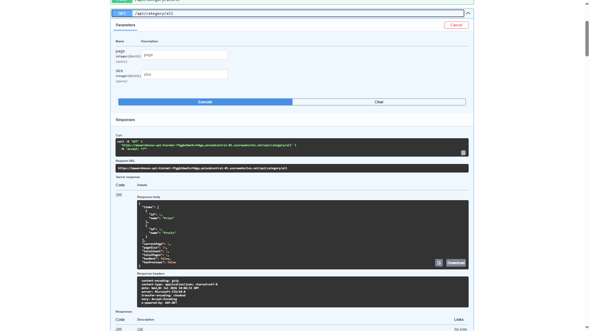
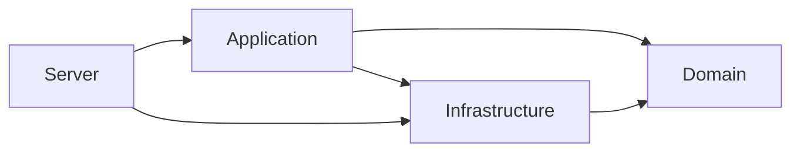

# MyWarehouse

MyWarehouse is a REST API for managing warehouse operations. It models inbound receipts, pallet storage, inventory, outbound orders, picking, reverse picking, and operation history.

The project uses a layered architecture, CQRS, and a domain model inspired by Domain-Driven Design. It is being gradually refactored to reduce coupling between the Application and Infrastructure layers.

## Links

- [GitHub repository](https://github.com/MikeMucik/MyWerehouse)
- [Swagger UI on Azure](https://mywarehouse-api-hiermet-ffggb2dwe5crh4gq.polandcentral-01.azurewebsites.net/swagger.html)
- [GitHub Actions workflow](https://github.com/MikeMucik/MyWerehouse/actions)

## Features

- Goods receipts
- Inventory management
- Pallet and warehouse location management
- Outbound order processing
- Product allocation
- Planned, emergency, and manual picking
- Reverse picking
- Operation history

## API documentation



## Architecture

The solution is divided into four main layers:

- **Server** exposes the HTTP API, configures dependency injection, and handles exceptions.
- **Application** implements use cases through commands, queries, handlers, application services, validation, and result types.
- **Domain** contains entities, aggregates, domain rules, events, exceptions, and repository contracts.
- **Infrastructure** provides the EF Core `DbContext`, entity configurations, migrations, and repository implementations.

The current project dependencies are shown below:



The Application layer currently references Infrastructure because several handlers and services use the concrete EF Core context. Removing this dependency is part of the planned migration towards Clean Architecture.

## Solution structure

```text
MyWerehouse.Server/          Controllers, middleware, Swagger, and application startup
MyWerehouse.Application/     Commands, queries, handlers, services, validation, and DTOs
MyWerehouse.Domain/          Aggregates, entities, domain events, rules, and repository contracts
MyWerehouse.Infrastructure/  EF Core DbContext, configurations, migrations, and repositories
MyWerehouse.Test/            Integration, validation, mapping, and repository tests
```

## Technology stack

- .NET 9
- ASP.NET Core Web API
- Entity Framework Core
- SQL Server and Azure SQL
- MediatR and CQRS
- FluentValidation
- AutoMapper
- Swagger / OpenAPI
- xUnit and FluentAssertions
- SQLite In-Memory and EF Core In-Memory
- Azure App Service
- GitHub Actions

## Testing

The automated test suite covers application handlers, repositories, validation, mappings, and warehouse business scenarios. Important workflows are tested against SQLite In-Memory using the real EF Core model and repository implementations. Simpler CRUD service tests use the EF Core In-Memory provider.

The GitHub Actions workflow restores dependencies, builds the solution in the Release configuration, and runs the test suite on every push and pull request to `master`.

## Running locally

### Prerequisites

- .NET 9 SDK
- SQL Server LocalDB
- Entity Framework Core CLI tools (`dotnet-ef`)

The development connection string is defined in `MyWerehouse.Server/appsettings.Development.json` and uses SQL Server LocalDB.

From the solution directory, restore the dependencies and apply the database migrations:

```bash
dotnet restore MyWerehouse.sln
dotnet ef database update --project MyWerehouse.Infrastructure --startup-project MyWerehouse.Server
```

Start the API:

```bash
dotnet run --project MyWerehouse.Server
```

Swagger UI is available at:

```text
https://localhost:7243/swagger
```

Run the test suite with:

```bash
dotnet test MyWerehouse.sln
```

## Domain

The warehouse model is based on the following business concepts:

- **Issue** - an outbound order that defines which goods should be prepared and shipped to a client.
- **Receipt** - an inbound delivery containing one or more pallets received by the warehouse.
- **Pallet** - a physical warehouse pallet containing products and assigned to a warehouse location.
- **Picking** - the process of collecting products for an outbound order.
- **Reverse picking** - the process of returning previously picked products when an outbound order is cancelled.
- **Best-before date** - the product date considered when pallets are allocated to an outbound order.

## Future improvements

- Complete the migration to Clean Architecture by removing the Application layer's dependency on Infrastructure.
- Add authentication and authorization.
- Add containerized deployment support.
- Extend pallet allocation policies.
- Add warehouse workload planning.
