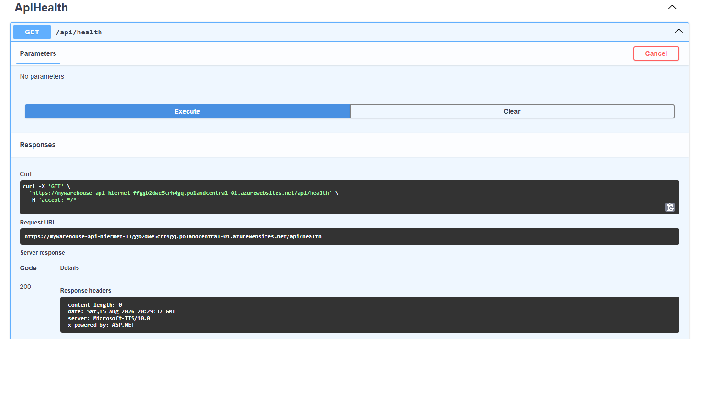
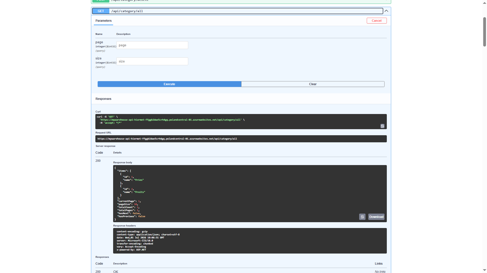
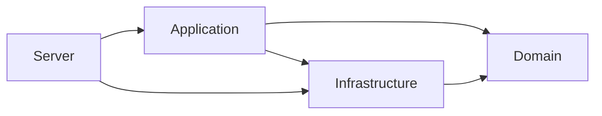

# MyWarehouse

[](https://github.com/MikeMucik/MyWerehouse/actions/workflows/dotnet.yml)
[](https://mywarehouse-api-hiermet-ffggb2dwe5crh4gq.polandcentral-01.azurewebsites.net/swagger.html)
[](https://dotnet.microsoft.com/)

MyWarehouse is a deployed ASP.NET Core REST API that models real warehouse
operations: receiving, pallet storage, inventory, outbound orders, picking,
loading, reverse picking, and operation history.

The project demonstrates a pragmatic layered architecture with CQRS,
domain-driven business rules, Entity Framework Core, Azure SQL, automated
testing, and deployment to Azure App Service.

[**Open live Swagger**](https://mywarehouse-api-hiermet-ffggb2dwe5crh4gq.polandcentral-01.azurewebsites.net/swagger.html)
[CI workflow](https://github.com/MikeMucik/MyWerehouse/actions/workflows/dotnet.yml)

## Azure demo availability

> **Azure F1 cold start:** after inactivity, the first request may take approximately
> 40 seconds. Use the Apihealth endpoint 
> to wake up the application.

<details>
<summary>How to wake up the Azure demo</summary>



</details>
## What this project demonstrates

- Complete warehouse flow: Receipt → Inventory → Issue → Picking → Loading
- Planned, emergency, manual, partial, and reverse picking
- Domain-controlled state transitions and business invariants
- Best-before batch handling and pallet allocation
- Atomic, concurrency-safe pallet number reservation
- Operation history created through domain events
- 347 automated tests covering handlers, repositories, validation, mappings,
  and business workflows
- Hosting on Azure App Service and Azure SQL, with CI provided by GitHub Actions

## Ready-to-explore demo scenarios

| Issue | Scenario |
|---|---|
| `900001` | Outbound order with an allocated planned-picking task |
| `900002` | Outbound order prepared for manual picking |
| `900003` | Completed picking, ready for loading |
| `900004` | Cancelled order with an active reverse-picking task |

Demo products use SKUs beginning with `DEMO-`. Demo pallets are numbered
sequentially from `Q0001` to `Q0008`.

## API documentation



## Architecture

The solution is divided into four main layers:

- **Server** exposes the HTTP API, configures dependency injection, and handles exceptions.
- **Application** implements use cases through commands, queries, handlers, application services, validation, and result types.
- **Domain** contains entities, aggregates, domain rules, events, exceptions, and repository contracts.
- **Infrastructure** provides the EF Core `DbContext`, entity configurations, migrations, and repository implementations.

The current project dependencies are shown below:


```mermaid
graph LR
    Server --> Application
    Server --> Infrastructure
    Application --> Domain
    Application --> Infrastructure
    Infrastructure --> Domain
```

The direct Application-to-Infrastructure dependency reflects the current
architecture milestone and is the main boundary scheduled for the next
large-scale refactoring.

## Current architecture milestone

The current release represents a complete and deployable milestone. Core warehouse
workflows are implemented, hosted on Azure, and covered by automated tests.

Business invariants and state transitions are implemented in domain entities
and domain services. Application handlers coordinate use cases, persistence,
and workflows that span multiple entities. This division is intentional:
cross-aggregate orchestration remains in the Application layer when moving it
into the Domain would introduce additional complexity without a meaningful benefit.

The solution is being incrementally evolved toward Clean Architecture. The next
major architectural milestone is removing the Application layer's direct
dependency on Infrastructure while preserving the current division between
domain rules and application-level orchestration.

### Error handling

- `DomainException` represents violations of business invariants.
- `AppResult` represents application-level outcomes, including operations that
  aggregate results for multiple products.
- Exception middleware translates domain failures into consistent HTTP responses.

## Solution structure

```text
MyWerehouse.Server/          Controllers, middleware, Swagger, and application startup
MyWerehouse.Application/     Commands, queries, handlers, services, validation, and DTOs
MyWerehouse.Domain/          Aggregates, entities, domain events, rules, and repository contracts
MyWerehouse.Infrastructure/  EF Core DbContext, configurations, migrations, and repositories
MyWerehouse.Test/            Integration, validation, mapping, and repository tests
```

## Technology stack

- .NET 9
- ASP.NET Core Web API
- Entity Framework Core
- SQL Server and Azure SQL
- MediatR and CQRS
- FluentValidation
- AutoMapper
- Swagger / OpenAPI
- xUnit and FluentAssertions
- SQLite In-Memory and EF Core In-Memory
- Azure App Service
- GitHub Actions

## Testing

The automated test suite covers application handlers, repositories, validation, mappings, and warehouse business scenarios. Important workflows are tested against SQLite In-Memory using the real EF Core model and repository implementations. Simpler CRUD service tests use the EF Core In-Memory provider.

The GitHub Actions workflow restores dependencies, builds the solution in the Release configuration, and runs the test suite on every push and pull request to `master`.

## Running locally

### Prerequisites

- .NET 9 SDK
- SQL Server LocalDB
- Entity Framework Core CLI tools (`dotnet-ef`)

The development connection string is defined in `MyWerehouse.Server/appsettings.Development.json` and uses SQL Server LocalDB.

From the solution directory, restore the dependencies and apply the database migrations:

```bash
dotnet restore MyWerehouse.sln
dotnet ef database update --project MyWerehouse.Infrastructure --startup-project MyWerehouse.Server
```

Start the API:

```bash
dotnet run --project MyWerehouse.Server
```

Swagger UI is available at:

```text
https://localhost:7243/swagger.html
```

Run the test suite with:

```bash
dotnet test MyWerehouse.sln
```

## Domain

The warehouse model is based on the following business concepts:

- **Issue** - an outbound order that defines which goods should be prepared and shipped to a client.
- **Receipt** - an inbound delivery containing one or more pallets received by the warehouse.
- **Pallet** - a physical warehouse pallet containing products and assigned to a warehouse location.
- **Picking** - the process of collecting products for an outbound order.
- **Reverse picking** - a task created after cancelling an issue when picked goods must be physically returned from the picking pallet.
- **Best-before date** - the product date considered when pallets are allocated to an outbound order.

## Example business flow

Receipt → Pallet → Inventory → Issue → Picking → Loading

1. Create an inbound receipt.
2. Add pallets and products.
3. Confirm receipt and update inventory.
4. Create an outbound issue.
5. Allocate pallets and picking tasks.
6. Complete picking and loading.

## Roadmap

- Complete the transition to Clean Architecture by removing the Application
  layer's direct dependency on Infrastructure.
- Add authentication and role-based authorization.
- Add containerized local and deployment support.
- Introduce additional allocation policies, including FEFO.
